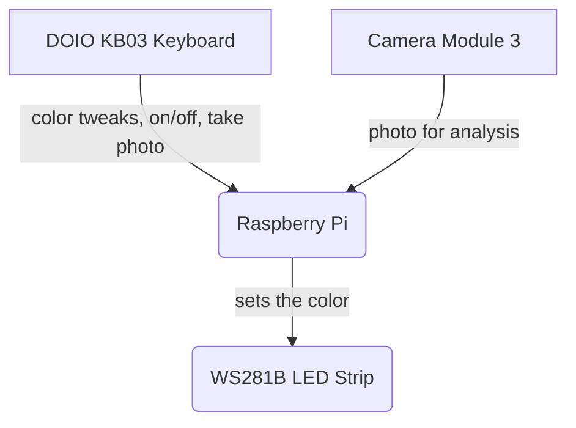

# DJ Lights
A node script for a Raspberry Pi that controls and sets the color of WS281B LED light strip based on prominent colors on album art.

## How it Works
### Physical Setup
Lights are controlled by a combination of two inputs.
1. A Raspberry Pi Camera Module used to take a photo of the album art. The resulting photo is fed to `node-vibrant` to the prominent color to send to the lights
2. A mini-keyboard with a knob to manually tweak the color, take a photo, and turn on the lights on or off.

### Camera process
An input from Keyboard triggers this flow...
1. Take a photo with a Raspberry Pi Camera Module 3 – cheaper options output inconsistent colors. Automatic White Balance is applied differently based on the time of day.
2. Image is loaded in a canvas. Black squares are drawn over recurring glare in my setup. This is done because this causes the color algorithm to pick up on the glare instead of the color we actually want.
3. Using `node-vibrant`, we get a palette from the photo. The returned palette has named colors like `Vibrant` and `MutedLight`. Bias towards the `Vibrant` swatch unless it has a low percentage coverage of the image or another swatch has an high percentage.
4. The colors are tweaked and boosted based on various conditions. For example: A color that is in the red hue will get boosted red and reduced green and blue values as a hex that looks red will be rendered pink on the LED strip.
5. A final color is passed to a function that will fade the LED lights to the color.

### Keyboard controls
A DOIO KB03 Keyboard allows for...
- Take a photo and start the camera process above
- Tweak the current hue
- Tweak the current saturation
- Turn the brightness up, down, or off

## Development
### Requirements
- Node v16.13.1 to run the script
- `node-canvas` requirements...
`sudo apt-get install build-essential libcairo2-dev libpango1.0-dev libjpeg-dev libgif-dev librsvg2-dev`
- Sudo access for `rpi-ws281x-native`
- `pm2` to permanently keep the script running

### Installation
Once you have the requirements running `npm i` will get you the dependencies.

### Usage
Use `npm run start` to start the script on the Pi

`npm run kill` will stop the script and `npm run logs` will tail the logs while it's running.

There's also a `npm run connect` script which is just a shortcut to connect to the local Pi.

### Config
The config.json file lets you setup the light settings (number of LEDs and the GPIO it's plugged into on the Pi). It also lets you change the input device and what keys need to be pressed on the keyboard to control everything.
