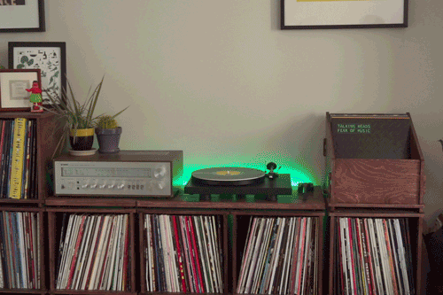
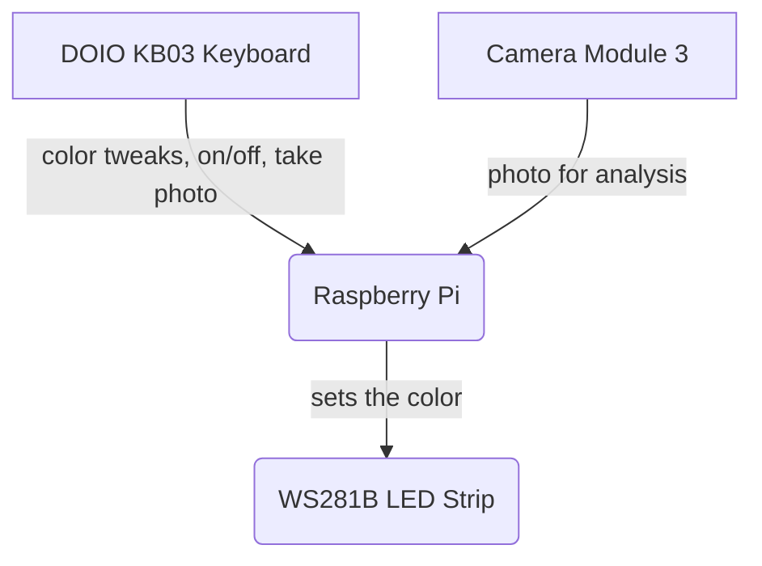

# DJ Lights
TK TK TK TK TK

# DJ Lights
A node script for a Raspberry Pi that controls and sets the color of WS281B LED light strip based on prominent colors on album art.

## How it Works
### Dataset
1. `npm run discogs` fetches information on all albums in a user's Discogs collection.
2. `npm run embedding` creates "embeddings" for every album cover that was downloaded
3. `npm run colors` gets the target color for the lights from every album cover
4. `npm run data` combine everything into a nice clean json file

### Physical Setup
Lights are controlled by a combination of two inputs.
1. A Raspberry Pi Camera Module used to take a photo of the record's cover
2. A mini-keyboard with a knob to manually tweak the color, take a photo, and turn on the lights on or off.

```mermaid
flowchart TD;
    A[DOIO KB03 Keyboard] -->|color tweaks, on/off, take photo| B(Raspberry Pi);
    B --> |sets the color| C(WS281B LED Strip);
    D[Camera Module 3] --> |photo for analysis| B;
```

### Camera process
An input from Keyboard triggers this flow...
1. Take a photo with a Raspberry Pi Camera Module 3 – cheaper options output inconsistent colors.
2. Image is fed into the same model we used to generate the album art "embeddings" to find the best match
3. Send color from best match to the lights

### Keyboard controls
A DOIO KB03 Keyboard allows for...
- Take a photo and start the camera process above
- Tweak the current hue
- Tweak the current saturation
- Turn the brightness up, down, or off

## Development
### Requirements
- Node v22 to run the script
<!-- - Requirements to use canvas: `sudo apt-get install build-essential libcairo2-dev libpango1.0-dev libjpeg-dev libgif-dev librsvg2-dev` -->
– Requirements to keep the script running: `npm install pm2 -g`
- Sudo access for `rpi-ws281x-native`
<!-- - `pip install transformers==4.49.0 torch Pillow` -->

### Installation
Once you have the requirements running `npm i` will get you the dependencies.

### Usage
Use `npm run start` to start the script on the Pi

`npm run kill` will stop the script and `npm run logs` will tail the logs while it's running.

There's also a `npm run connect` script which is just a shortcut to connect to the local Pi.

You can also run `npm run download` to download the last capture from the local Pi.

### Config
The config.json file lets you setup the light settings (number of LEDs and the GPIO it's plugged into on the Pi). It also lets you change the input device and what keys need to be pressed on the keyboard to control everything.
